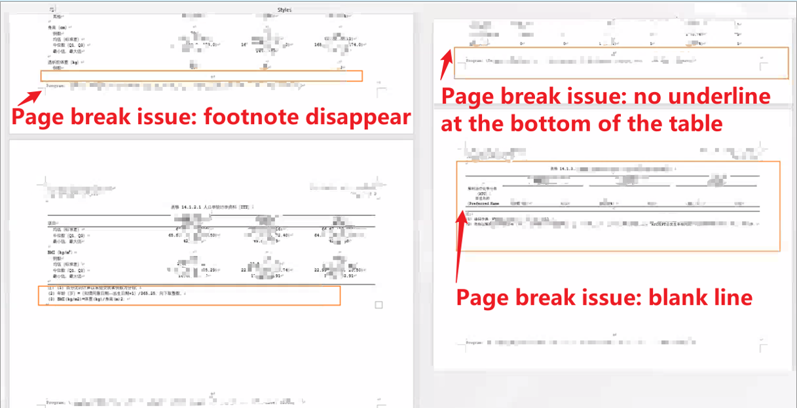
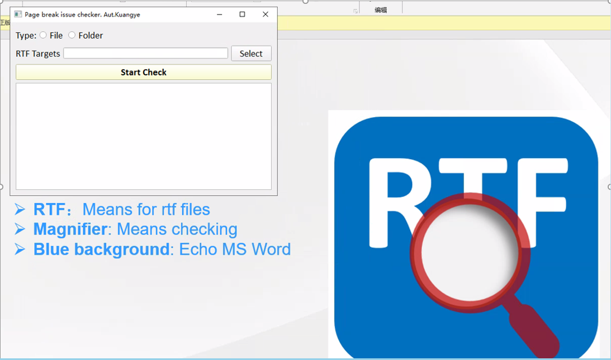
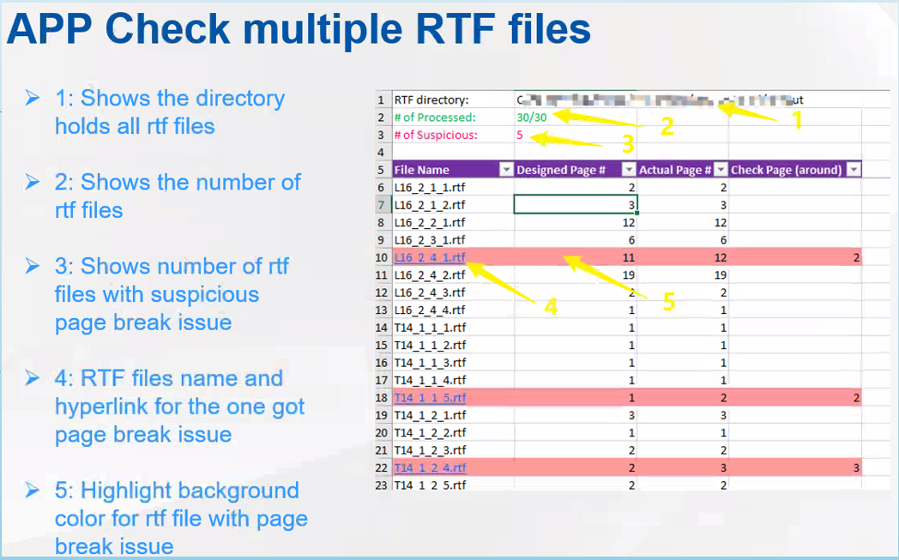

# RTF_PageBreakChecker_APP
App for check and summary all RTF page break issue. This app is developed with python. Applciation can be found and downlod from release.

# RTF page break issue
When generating report in SAS, RTF pages may be missing expected footnotes, underlines, or have some unnecessary blank pages inserted.
All of these output flaws will create headaches for output reviewers. 

# Graphical User Interface for this APP
There are mainly two checking modes available in the application. The first File mode allows checking a single RTF file. 
And the second Folder mode is a batch checker for entire folder of RTF files.

# Example summary report exported from APP after batch check

